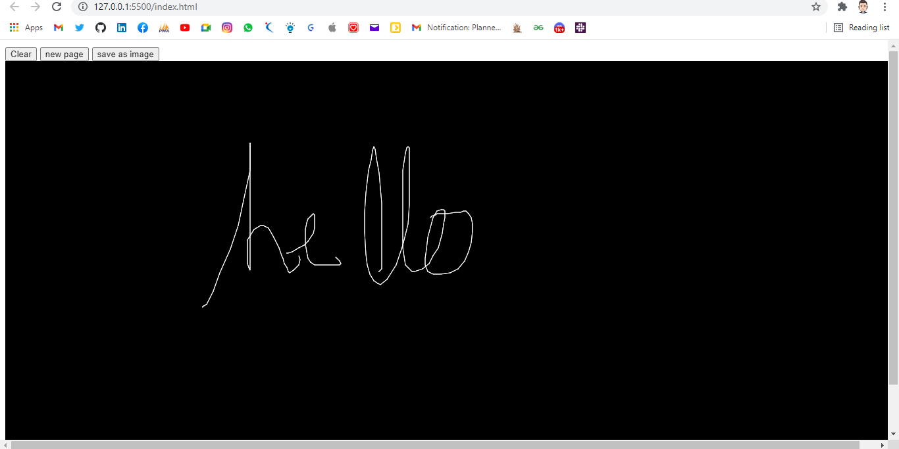

# Web Whiteboard 
Web Whiteboard is a project build with the similar functionality of whiteboard. It enables users to access various features like writing, clearing the entire whiteboard, and changing colors. [For demo please click here] https://github.com/binayakreddy.github.io/web_whiteboard

## Contributing
Pull requests are welcome. For major changes, please open an [issue](https://github.com/BinayakReddy/web_whiteboard/issues) first to discuss what you would like to change.

